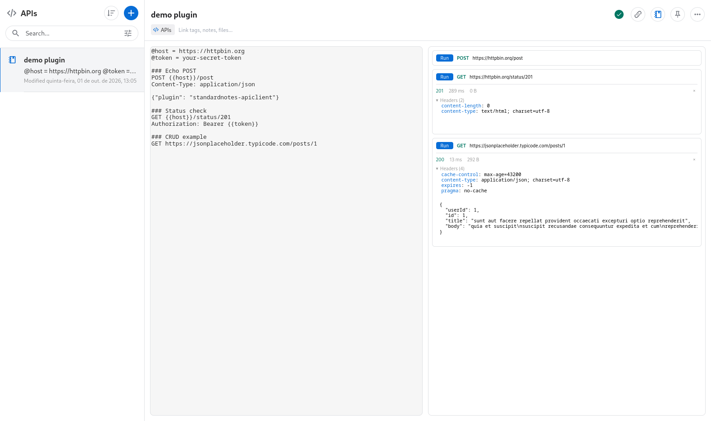

# StandardNotes API Client

[](https://github.com/Esl1h/StandardNotes-APIclient/actions/workflows/ci.yml)
[](https://github.com/Esl1h/StandardNotes-APIclient/releases/latest)
[](LICENSE)

An HTTP API client editor for [Standard Notes](https://standardnotes.com), a
free, open-source, end-to-end encrypted notes app. Requests are stored as
plain `.http` syntax (the format used by VS Code REST Client and
kulala.nvim) inside the note, so they stay readable, searchable, exportable
and portable. API tokens, payloads and variables benefit from native
end-to-end encryption, unlike typical web-based REST clients.



## Features

1. Write requests in the standard `.http`/`.rest` syntax: request blocks
   separated by `### Title` lines, optional variables at the top of the file
2. Variables defined with `@name = value`, referenced with `{{name}}` in
   urls, headers and bodies (variables can reference earlier variables)
3. Run a single request block with its `Run` button; the response renders
   inline right below the block: status (color coded), elapsed time, body
   size, headers (collapsible) and body; images are previewed and other
   binary responses can be downloaded
4. Cancel running requests and close responses; responses are volatile and
   never written to the note (your note stays lightweight and the note text
   is never modified by a run)
5. Your requests live in the note as plain text; the global Standard Notes
   search finds them by url, header name or endpoint title without opening
   the editor
6. Works with the Standard Notes web, desktop and mobile apps; follows the
   theme selected in the app. On narrow screens the editor and the requests
   stack vertically
7. A new empty note shows an `Add sample` button that seeds the note with
   working example requests against httpbin.org and jsonplaceholder
8. If the editor ever fails to render, the raw note text stays available
   and editable in a plain text area, and edits are still saved

Requests are sent straight from the editor, so only CORS-enabled endpoints
answer; when a request fails with a blocked fetch, the block says it is
probably CORS. For endpoints that do not send CORS headers, use a
CORS-friendly endpoint; a local proxy companion is planned (see
`docs/roadmap.md`).

### Try it online

A live sandbox of the editor (no Standard Notes install needed) is hosted
next to the extension:

`https://esli.cafe/StandardNotes-APIclient/demo.html`

In the sandbox the note text is kept in your browser's localStorage and
only CORS enabled endpoints answer requests (httpbin.org and
jsonplaceholder do). Use the <strong>Reset demo</strong> button at the
bottom to restore the sample content.

## Installation

1. Run the Standard Notes web or desktop app.
2. Click the **Preferences** (gear) icon.
3. Select **Plugins** in the Preferences menu.
4. Scroll to the bottom and paste this URL into the
   **Install Custom Plugin** box:

   ```
   https://esli.cafe/StandardNotes-APIclient/ext.json
   ```

5. Confirm the installation.
6. Create a new note, open the **Editor** menu and pick **API Client**.

## Note format

The note body is a single `.http` file:

```http
@host = https://httpbin.org
@token = your-secret-token

### Echo POST
POST {{host}}/post
Content-Type: application/json

{"plugin": "standardnotes-apiclient"}

### Status check
GET {{host}}/status/201
Authorization: Bearer {{token}}

### CRUD example
GET https://jsonplaceholder.typicode.com/posts/1
```

- `### Title` starts a new request block
- `@name = value` defines a variable; `{{name}}` interpolates it
- Environments are defined in the file itself: `@name.staging = value`
  adds a value for the `staging` environment and `@env = staging` declares
  the active one. The editor shows environment chips above the variable
  list; requests resolve values from the active environment first and
  fall back to the unsuffixed ones. `{{name.prod}}` references an
  environment value explicitly.
- `METHOD url [HTTP/1.1]` is the request line; the version suffix is
  optional, and a bare `https://...` or `{{variable}}/path` line defaults
  to `GET`
- Lines starting with `?` or `&` right after the request line continue the
  query string
- `Name: value` lines between the request line and the first blank line are
  headers; a repeated header (in any letter case) is merged into one
- Everything after the first blank line of the block is the request body,
  without its trailing blank lines
- `#` and `//` lines outside a body are comments
- `# @name login` labels the request that follows (or the current one, before
  its body) for chaining: once it runs, later requests can interpolate
  `{{login.response.body.$.field}}` (a JSONPath subset: `$`, `.field`,
  `[index]`, `[*]`) and `{{login.response.headers.X-Token}}` from the recorded
  response. References resolve at run time and are never saved into the note.
  Because `response` and `request` mark a chaining reference, an environment
  cannot be named `response` or `request`
- Dynamic variables are generated on every run, never saved:
  `{{$uuid}}`, `{{$timestamp}}` (unix seconds), `{{$randomInt 1 10}}`
  (inclusive) and `{{$datetime}}` or `{{$datetime rfc1123}}` (iso8601 by
  default)
- The variable list masks the value of names containing `token`, `secret`,
  `key`, `password` or `auth` until you press `show`; `copy` always copies
  the real value
- Responses are shown under each block at run time and are not saved;
  images are previewed and any binary response can be downloaded
- `Ctrl/Cmd+Enter` in the source runs the request under the caret
- `Run all` runs every request in file order, waiting for each one so a
  chained request reads the response recorded by the request before it, and
  stops at the first failure (each block shows its own error and hint)
- `# @assert <lhs> <op> <rhs>` lines inside a block are checked against its
  response and shown as ✓/✗; the left side can be `status`, `headers.<name>`,
  `body` or `body.$.path`, the operators are `==`, `!=`, `>`, `<`, `>=`, `<=`,
  `exists` and `not exists`, and a malformed assertion never passes silently
- Browsers never send headers such as `Host`, `Cookie` or `Origin`; the
  block warns when a request declares one

## Privacy

Your requests, variables and tokens are stored inside your Standard Notes
note and encrypted with the rest of your data. Running a request does send
the described request to the target endpoint (that is the point of an API
client), but nothing is stored or transmitted anywhere else; responses stay
in memory.

## Development and running locally

**Prerequisites:**

1. (Optional) Fork this repo on GitHub.
2. [Clone](https://docs.github.com/en/repositories/creating-and-managing-repositories/cloning-a-repository)
   this repo or your fork.
3. Run `cd StandardNotes-APIclient` and then `npm install` to install all
   dependencies.

### Testing in the browser (standalone)

1. Run:

```
npm start
```

2. If no browser opens automatically, open `http://localhost:3001/`. The
   standalone editor runs without a Standard Notes context, so saving is
   disabled but the UI is fully usable.
3. When you're done, press `Ctrl/Cmd + C` in the console to stop the app.

### Testing inside your local Standard Notes app

1. Run `npm run build` to build the app, then:

```
npm run server-cors
```

2. In Standard Notes, follow the Installation steps above but paste:

```
http://localhost:3000/ext.dev.json
```

The dev extension uses a separate identifier (`API Client (Dev)`) so it
does not clash with the hosted one.

3. When you're done, press `Ctrl + C` to shut down the server.

If you run into issues, please refer to the
[Standard Notes instructions for local plugin setup](https://standardnotes.com/help/plugins/local-setup).

### Deployment

The extension is hosted on GitHub Pages from the `gh-pages` branch, served
at `https://esli.cafe/StandardNotes-APIclient/`. Releases are automated by
the `Release` workflow:

1. Bump the version in `package.json` and `public/ext.json` (also its
   `download_url`) in one `chore(release)` commit. The `Release` workflow
   rewrites the version on the distributed `ext.json` (zip + Pages), so the
   desktop app updates automatically by comparing the version at
   `latest_url`; keeping the committed copy in sync avoids a misleading one.
2. On `main`, push a tag whose version matches `package.json` (the workflow
   fails otherwise):

```
git tag -a vX.Y.Z -m vX.Y.Z && git push origin vX.Y.Z
```

The workflow builds, runs the checks, attaches `extension.zip` to the
GitHub release (that zip is what the desktop app installs) and publishes
the hosted build to Pages.

## Credits and license

- Built on [Standard Notes](https://standardnotes.com) and
  [@standardnotes/editor-kit](https://github.com/standardnotes/editor-kit)
- `.http` format inspired by VS Code REST Client, kulala.nvim and Bruno
- Licensed under [AGPL-3.0](LICENSE) or later
